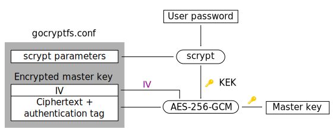
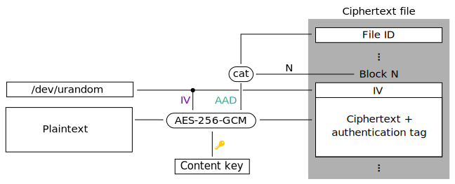
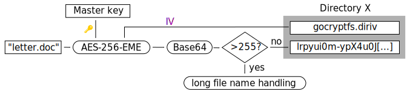
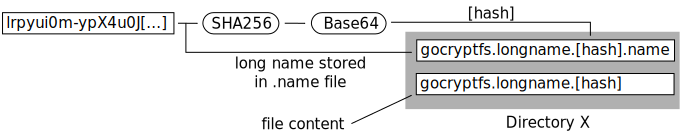

gocryptfs Cryptography
======================

gocryptfs builts upon well-known cryptographic primitives: scrypt for
key derivation, AES-GCM for file content encryption and, as a world's
first for encrypted filesystems,
EME wide-block encryption for file name encryption.

This page describes **forward mode**, the default mode of operation, where
the files are stored encrypted on disk and the mounted filesystem provides
a plaintext view.

Master Key Storage
------------------

The master key is used to perform content and file name encryption.
It is stored in `gocryptfs.conf`, encrypted with AES-256-GCM using the
Key Encryption Key (KEK). The KEK is generated from the user password
using `scrypt`.

When mounting a filesystem, the user is prompted for the password and
the master key is decrypted:



Derived Keys
------------

Since gocryptfs v1.3, separate keys are derived from the master key for
file content and file name encryption. HKDF-SHA256 is used for the
derivation (source code: [ref1](https://github.com/rfjakob/gocryptfs/blob/f0e29d9b90b63d5fbe4164161ecb0e1035bb4af4/internal/cryptocore/hkdf.go)
[ref2](https://github.com/rfjakob/gocryptfs/blob/f0e29d9b90b63d5fbe4164161ecb0e1035bb4af4/internal/cryptocore/cryptocore.go#L66)).


File Contents
-------------

All file contents are encrypted using AES-256-GCM (Galois/Counter Mode).

Files are segmented into 4KiB blocks. Each block gets a fresh random
128 bit IV each time it is modified. A 128-bit authentication tag (GHASH)
protects each block from modifications.

Each file has a header containing a random 128-bit file ID. The
file ID and the block number are concatenated
(source code [ref](https://github.com/rfjakob/gocryptfs/blob/64e5906ffa1f225a51048b3d0ac6b1a09e2ca170/internal/contentenc/content.go#L124))
and mixed into the GHASH as
*additional authenticated data*. This prevents blocks from being copied
between or within files.



To support sparse files, all-zero blocks are accepted and passed through
unchanged.

File Names
----------

Every directory gets a 128-bit directory IV that is stored in each
directory as `gocryptfs.diriv`.

File names are encrypted using AES-256-EME (ECB-Mix-ECB wide-block encryption,
see [github.com/rfjakob/eme](https://github.com/rfjakob/eme) for details) with the directory IV
as initialization vector. EME fixes the prefix leak that occours with CBC
encryption.



Padding and base64-encoding limit the usable filename length to 175 characters.
Filenames that are longer than that (longer than 255 characters in
Base64-encoded form) use long file name handling, introduced in gocryptfs v0.9.

Long File Name Handling
-----------------------

If the base64-encoded encrypted name is longer than 255 characters,
it cannot be used as the file name on disk, as common Linux filesystems
do not allow names longer than that.

Instead, the encrypted name is hashed, and the file content is stored in
`gocryptfs.longname.[hash]`. The long file name is stored in a support
file, `gocryptfs.longname.[hash].name`.



Example directory listing containing an 1 MiB encrypted file with a long name:

```
    Size Name
      16 gocryptfs.diriv
 1056786 gocryptfs.longname.nONaEDDZOrwtQdXPH1SxSFkPtOc8srIyB82ZuduqG10
     299 gocryptfs.longname.nONaEDDZOrwtQdXPH1SxSFkPtOc8srIyB82ZuduqG10.name
```

This method for storing long file names has zero performance impact
for filenames that are <= 175 characters, incurs no extra disk accesses
for opening a file with a long name, and just one extra file read for each
long-name file on readdir(1).

Because the hash is only taken from the encrypted file name that is public
anyway, there is no security penalty for using long names.
