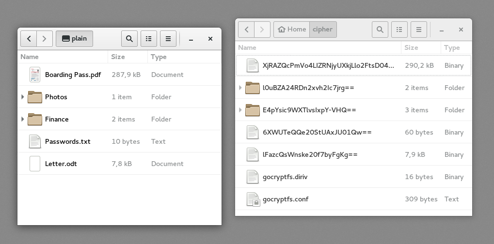

gocryptfs - simple. secure. fast.
=================================

gocryptfs uses file-based encryption that is implemented as a mountable
FUSE filesystem.
Each file in gocryptfs is stored one corresponding encrypted files on the hard disk. The 
screenshot below shows a mounted gocryptfs filesystem (left) and the
encrypted files (right).

The encrypted files can be stored in any folder on your hard disk, a USB
stick or even inside the Dropbox folder. One advantage of file-based
encryption as opposed to disk encryption is that encrypted files can
be synchronised efficiently using standard tools like Dropbox or rsync.
Also, the size of the encrypted filesystem is dynamic and only limited
by the available disk space.

This project was inspired by EncFS and strives to fix its security
issues while providing good performance,
see the [Comparison](comparison) page for benchmarks.
The [Security](security) page details gocryptfs's cryptographic design.
The highlights are: Scrypt password hashing, GCM encryption for all
file contents, EME wide-block encryption for file names with a per-directory
IV.

gocryptfs is a young project. While bugs in any software can cause issues,
bugs in encryption software can cause catastrophic data loss. Keep a backup
of your gocryptfs filesystem *and* store a copy of your master key (printed
on mount) in a safe place.

Only Linux is supported at the moment. Help is wanted for a Mac OS X port,
please chime in in the ["Mac OS X support" ticket](https://github.com/rfjakob/gocryptfs/issues/15)
if you are interested.

gocryptfs is, and always will be, free software.
