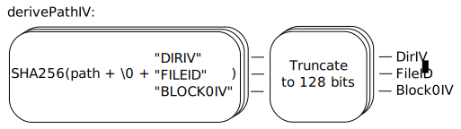
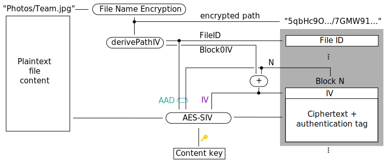

Reverse Mode
============

In **reverse mode**, gocryptfs provides an encrypted view of a
plain-text directory. The primary use-case are encrypted backups.

To make reverse mode useful, it uses deterministic encryption using
AES-SIV instead of AES-GCM.

The differences with respect to the "normal" (forward) mode as detailed
on the [Cryptography](forward_mode_crypto.md) page are listed below.

Derived Keys
------------

As in forward mode, the file content key is derived from the master key
using HKDF-SHA256. Is is 64 bytes wide instead of 32 bytes
(source code [ref](https://github.com/rfjakob/gocryptfs/blob/f0e29d9b90b63d5fbe4164161ecb0e1035bb4af4/internal/cryptocore/cryptocore.go#L111)).
for use with AES-SIV-512.

Derived IVs
-----------

All values that are random in forward mode (Dir IV, File ID, Block IV)
are instead deterministically derived from the encrypted path.
The encrypted path is concatenated with a null byte and a
purpose string (one of "DIRIV", "FILEID", "BLOCK0IV"). The extended string
is hashed with SHA256 and truncated to 128 bits (source code
[ref](https://github.com/rfjakob/gocryptfs/blob/f0e29d9b90b63d5fbe4164161ecb0e1035bb4af4/internal/pathiv/pathiv.go#L26)):

All derived values are explicitely stored in the ciphertext,
so that decryption requires no knowledge of the derivation
algorithm.

File Contents
-------------

File contents are encrypted using AES-SIV-512 (RFC5297).
The encryption process is shown in the diagram below.

Notes:

1. The IV is passed to AES-SIV as described in
   [RFC5297 section 3](https://tools.ietf.org/html/rfc5297#section-3)
   as an additional component of the associated data
   (source code [ref](https://github.com/rfjakob/gocryptfs/blob/f0e29d9b90b63d5fbe4164161ecb0e1035bb4af4/internal/siv_aead/siv_aead.go#L60)).
2. The block number N is mixed into the IV as well as into the AAD.
   Either one or the other would suffice, but this construction simplifies
   the decryption process by keeping it largely identical to forward mode.
   The "duplication" is considered to not have
   any security impact because IV and AAD contain 128 bits of
   pseudo-random data each (FileID and Block0IV) and S2V
   ([RFC5297 section 2.4](https://tools.ietf.org/html/rfc5297#section-2.4))
   hashes the components independently before XORing them together.

File Names
----------

File name encryption is identical to forward mode, with the exception
that the directory IV (stored in `gocryptfs.diriv`) is not random.
It is deterministically derived from the encrypted
path to the directory.

Because the encrypted path to the root directory is "" (the empty string),
this means that the directory IV in the root directory is always
`0xa8f7bac432ddc1cb3dc74e684d6ae48b = SHA256("\0DIRIV")`.
